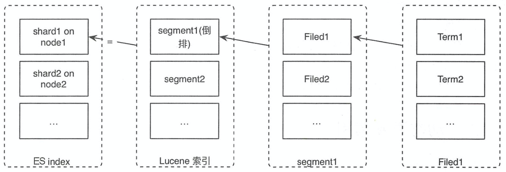

# ElasticSearch

### ES 索引，Lucene 索引，segment，filed 之间的关系？

《Elasticsearch源码解析与优化实战》p21

### refresh 操作和 flush 操作的作用？

客户端向集群中写入数据，集群接收数据后将数据缓存在内存中，待数据达到一定大小时，将数据组织成 segment 结构，然后写入文件系统。此时也没有实际写入磁盘，而是缓存在文件系统缓存中，也是内存中，操作系统会按照一定的频率写入磁盘。

refresh 操作的作用是无论此时有多少数据都生成一个新的 segment，然后写入文件系统，缓存到文件系统缓存。

flush 操作将文件系统缓存中的数据写入磁盘

《Elasticsearch源码解析与优化实战》p21、p23、p133

### 为什么 segment 文件大小不能超过磁盘空间的一半？

将两个或者多个 segment 合并为一个 segment 的过程中需要额外的磁盘空间，segment1 和 segment2 大小都为 1G，那么合并 segment1 和 segment2 需要的额外空间是 2G

《Elasticsearch源码解析与优化实战》p23

### 节点角色

* 主节点( Master node )
* 数据节点( Data node)
* 预处理节点( Ingest node) 预处理器和管道
* 协调节点(Coordinating node)
* 部落节点 (Tribe node) 集群联邦
* 客户端节点

《Elasticsearch源码解析与优化实战》p24

### 集群状态元数据有哪些？

* 集群配置信息
* 那个分片位于那个节点，也就是路由信息

《Elasticsearch源码解析与优化实战》p26

### ES 主要模块和相关功能？

* Cluster
* Allocation 实现分片的相关功能
* Discovery 发现集群中的节点，选举主节点
* Gateway
* Indices
* HTTP
* Transport
* Engine
* Node 单个节点的启动和关闭 P48 

### **集群启动流程**

	1. 选举主节点
	2. 选举集群元数据
	3. 选举主分片
	4. 选举副分片
	5. 恢复主分片数据
	6. 恢复副本分片数据

《Elasticsearch源码解析与优化实战》第三章

### 单个节点的启动和关闭过程

**单个节点的启动**

1. 解析配置，包括配置文件和命令行参数
2. 加载安全配置
3. 检查内部环境，包括 lucene 版本和 jar 包
4. 检查外部环境，包括操作系统配置和 JVM 配置 bootstrap check
5. 启动 keepalive 线程

**单个节点的关闭**

1. 关闭**主节点**导致选举产生新的主节点
2. 关闭**数据节点**时，最后的客户端的写操作可能成功，也可能失败；读操作会失败；分片的写入过程因为加锁操作还是会成功写入副本分片

节点启动流程做 的就是初始化和 检查工 作， 各个子模块启动后异步地工作，加载本地数据，或者选主、加入集群等。节点在关闭时有机会处理未写完的数据，但是写完后可能来不及通知客户端。

### 选举主节点

Discovery 发现 ping 集群中的节点，选举主节点

**Bully 算法**

Leader 选举的基本算法之一。它假定所有的节点都有唯一的一个 ID，使用该 ID 对节点进行排序。任何时候的当前 Leader 都是参与集群的最大 ID 节点。该算法的优点是易于实现。但是，当拥有最大 ID 的节点处于不稳定状态时会有问题。例如，master 负载过重而假死，集群拥有第二大 ID 的节点呗选举为新主，这时原来的 master 恢复，再次被选为新主，然后又假死...

ES 通过推迟选举，直到当前的 master 失效来解决这个问题。只有当前主节点不挂掉，就不进行重新选举。但是容易产生脑裂(双主)问题，再通过“法定得票人数过半”解决脑裂问题。

### 主分片和副本分片，维护数据一致性

Allocation 模块实现分片相关的功能

和分片相关的问题：
1. 选举主分片
2. 分配分片到节点
3. 数据在分片中的读写，包括主分片向副本分片中写数据
4. 维护分片元数据信息，包括哪个分片在哪个节点，最新数据列表 in-sync
5. 重新选举主分片后如何维护数据一致性

ps：重新选举主分片后如何维护数据一致性，这个需要使用到数据恢复流程。但是这个数据恢复流程和集群启动时主副分片的数据恢复流程不一样，不是同一个流程。

#### 选举主分片

选举主分片的时机：
1. 集群启动时
2. 在集群运行过程中，主分片节点宕机或者出现网络分区，此时需要重新选举

选举主分片都需要使用最新数据列表  in-sync ，在该表中选择

#### 分配分片到节点

在创建索引和修改配置时主节点直接将分片分配到节点，并且将分配信息记录在集群元数据中。但是在集群启动过程中，不会将分片分配信息汇报给主节点。而是汇报存储在节点磁盘上的分片信息，根据磁盘上的信息重新确定哪个分片在哪个节点。并且根据集群元数据 in-sync 列表选举主分片。

#### 数据在分片中的读写

ES 采用类似 PacificA 算法

1. 向副本分片写入数据的过程（数据副本策略）
2. 添加和删除分片的过程（配置管理）
3. 旧主副本和新主副本同时存在如何处理（错误检测）

《Elasticsearch源码解析与优化实战》第六章
《Elasticsearch源码解析与优化实战》第三章

### 集群重启时主副分片数据恢复流程，维护数据完整性

Indices.recovery 模块的功能

数据恢复的触发条件：
1. 从快照备份恢复
2. 节点的加入和离开
3. 索引的 _open 操作
4. shrink 操作

《Elasticsearch源码解析与优化实战》第十章

### 配置参数说明

《Elasticsearch源码解析与优化实战》p24
* node.master
* node.data
* node.ingest

《Elasticsearch源码解析与优化实战》p41
* cluster.routing.allocation.enable
* index.unassigned.node_left.delayed_timeout

《Elasticsearch源码解析与优化实战》p51
* bootstrap.system_call_filter

《Elasticsearch源码解析与优化实战》p57
* discovery.zen.minimum_master_nodes
* discovery.zen.ping.unicast.hosts
* discovery.zen.ping.unicast.hosts.resolve_timeout
* discovery.zen.ping_timeout
* discovery.zen.join_timeout
* discovery.zen.master_election.ignore_non_master_pings
* discovery.zen.fd.ping_interval
* discovery.zen.fd.ping_timeout
* discovery.zen.fd.ping_retries
* discovery.zen.commit_timeout
* discovery.zen.publish_timeout
* discovery.zen.no_master_block

《Elasticsearch源码解析与优化实战》p72
* index.write.wait_for_active_shards

《Elasticsearch源码解析与优化实战》p129
* indices.recovery.max_bytes_per_sec
* index.shard.check_on_startup

